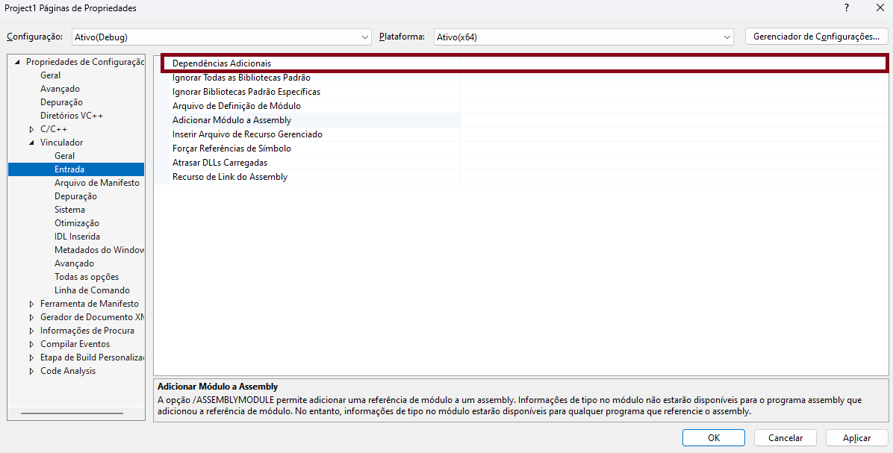

```{r setup, include=FALSE}
knitr::opts_chunk$set(echo = TRUE)
```

```{=html}
<style>
body
{
  text-align: justify
}

img{
  display: block;
  margin-left: auto;
  margin-right: auto;
}

.bordered{
  border-style: solid;
}
</style>
```


### 1 Introdução

Este tutorial tem o objetivo de apresentar as ferramentas necessárias para utilizar o solver *opensource* SCIP junto
a linguagem de programação C++ em ambiente Windows.Para isso é necessário usar o próprio compilador C++ da Microsoft, por meio
da IDE Microsoft Visual C++.

### 2 Instalando SCIP

O SCIP (**S**olving **I**nteger **C**onstraint **P**rogramming) é atualmente um dos solvers não-comerciais mais rápidos disponível. O SCIP permite total
acesso ao processo de resolução dos problemas, bem como a informações detalhadas sobre os algoritmos (https://scipopt.org/#scipoptsuite).


Para realizar o download do SCIP, acessar https://scipopt.org/index.php#download e baixar o arquivo **SCIPOptSuite-9.0.0-win64-VS15.exe** (pode mudar a versão com o tempo -  mostrado na imagem abaixo).


<div class="bordered">

</div>


Execute o arquivo de instalação. Nas opções de instalação lembre de adicionar o caminho à variável PATH, como mostrado na imagem abaixo.

<div class="bordered">

</div>


Para testar a instalação, digite SCIP na janela de busca do windows e execute o aplicativo. A seguinte tela é para aparecer:

<div class="bordered">

</div>

Com esse aplicativo já é possível resolver problemas, basta digitar help e acessar as funções. Porém este tutorial é focado na utilização conjunta com o C++.

### 3 Instalando Visual Studio C++

O Visual Studio é a poderosa IDE da Microsoft, sendo possível usar diversas linguagens de programação no ambiente. Para baixar o Visual Studio com todo o aparato para o desenvolvimento em C++ acesse: https://visualstudio.microsoft.com/pt-br/vs/features/cplusplus/. Faça o download da versão *Community*, como mostrado na imagem abaixo (o download tem aproximadamente 4GB).

<div class="bordered">

</div>

Execute o aplicativo para realizar a instalação da IDE.

### 4 Usando SCIP no MSVC

#### 4.1 Criando um projeto C++ no MSVC

Abra o MVSC e clique em Criar um Projeto -> Projeto Vazio ou Aplicativo de Console.

<div class="bordered">

</div>

Clique com o botão direito em 
 
 **Arquivos de Origem -> Adicionar -> Novo Item**
 
 Adicione um arquivo chamado "main.cpp". Escreva o código abaixo neste arquivo e execute o programa (botão verde  - **Depurador local do Windows** na parte superior). Um console com a mensagem "Ola" é para aparecer.


```{Rcpp, eval = FALSE}
#include <iostream>

using namespace std;

int main()
{
  cout << "Ola";
  return 0;
}
```

#### 4.2 Linkando a biblioteca e dependências

Clique com o botão direito na pasta do projeto e em seguida em propriedades. A seguinte janela é aberta:

<div class="bordered">

</div>

Na aba 

**C/C++->Geral->Diretórios de Inclusão Adicionais -> <Editar>**

Adicione o caminho da pasta de instalação do SCIP com nome "include". Algo como:

C:\\Program Files\\SCIPOptSuite 9.0.0\\include

Agora, em 

**Vinculador->Entrada->Dependências Adicionais**

insira o caminho do arquivo libscip.lib, que está contido na pasta "lib" do SCIP, algo como:

C:\\Program Files\\SCIPOptSuite 9.0.0\\lib\\libscip.lib

<div class="bordered">

</div>

Após essas inserções a biblitoeca já é para estar funcionando. Teste com o código abaixo, que lê um arquivo chamado "modelo.lp" e o resolve diretamente do MSVC. Lembre de alterar o caminho do modelo para um que exista.

```{Rcpp, eval = FALSE}
#include <iostream>

using namespace std;

#include <iostream>
#include <scip/scip.h>
#include <scip/scipdefplugins.h>

int main() 
  {
    // Inicializa o ambiente SCIP
    SCIP* scip = nullptr;
    SCIP_CALL_ABORT( SCIPcreate(&scip) );

    // Inicializa o SCIP
    SCIP_CALL_ABORT( SCIPincludeDefaultPlugins(scip) );
    SCIP_CALL_ABORT( SCIPcreateProbBasic(scip, "exemplo_lp") );

    // Carrega o modelo LP do arquivo
    const char* filename = "modelo.lp";
    SCIP_CALL_ABORT( SCIPreadProb(scip, filename, nullptr) );

    // Resolve o problema
    SCIP_CALL_ABORT( SCIPsolve(scip) );

    // Se encontrou uma solução ótima, imprime o valor da função objetivo
    if (SCIPgetNSols(scip) > 0) {
        std::cout << "Valor da função objetivo: " << SCIPgetPrimalbound(scip) << std::endl;
    } else {
        std::cout << "Não foi encontrada uma solução ótima." << std::endl;
    }

    // Libera o SCIP
    SCIP_CALL_ABORT( SCIPfree(&scip) );

    return 0;
  }
```


